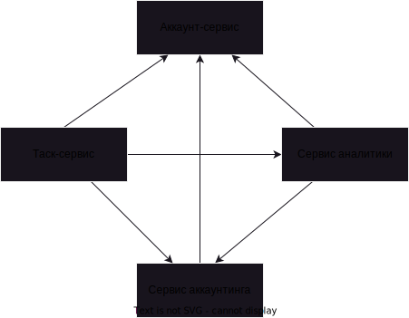

# Домашнее задание №0

## Аккаунт-сервис
Учет аккаунтов и взаимодействие с ними
### Данные:
- аккаунт
- роль
### Связи: отсутствуют

## Таск-сервис
Учет и назначение задач
### Данные:
- аккаунт
- роль
- задача
- статус задачи
- стоимость задачи
- награждение за задачу
### Связи:
- Сервис аккаунтов (синхронно) - запрос пользователя для авторизации
- Сервис аккаунтинга (асинхронно) - отправка выполненной задачи и попуга
- Сервис аналитики (асинхронно) - отправка выполненной задачи

## Сервис аккаунтинга
Учет счетов, транзакций и выплат
### Данные:
- аккаунт
- роль
- задачи
- транзакции по задачам (списания и зачисления)
- счет попуга
- выплаты
- отправленные уведомления
### Связи: 
- Сервис аккаунтов (синхронно) - запрос пользователя для авторизации
- Сервис аналитики (асинхронно) - сформированные отрицательные счета

## Сервис аналитики
Собранные метрики по требованиям бизнеса
### Данные:
- аккаунт администратора
- выполненные задачи (только идентификатор и награда )
- отрицательные попуги в день (идентификатор и дата)
### Связи:
- Сервис аккаунтов (синхронно) - запрос пользователя для авторизации

